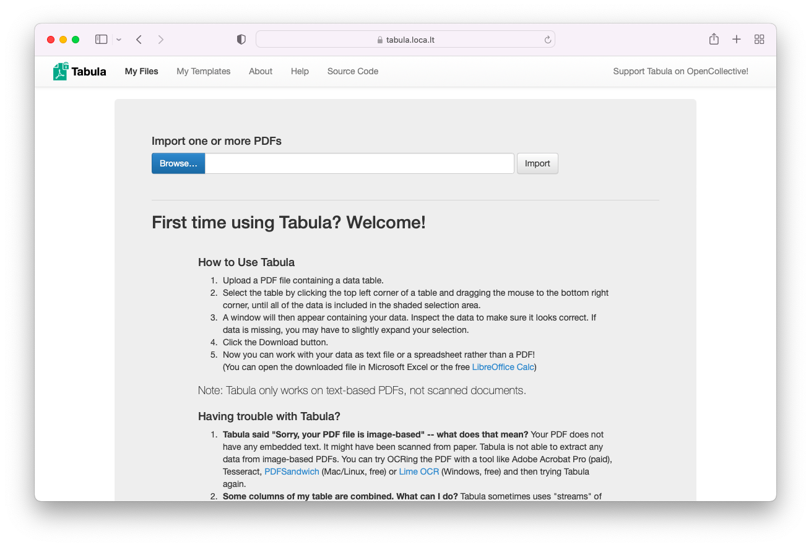

# Tabula &middot; [](https://github.com/flxhq/tabula.docker/actions/workflows/build.yml)

This repository contains Dockerfile for [Tabula](https://github.com/tabulapdf/tabula).



### Instructions to run the app

#### Build the Dockerfile

```bash
docker build -t tabula .
```

#### Run the Docker app

```bash
docker run --rm -it -p 8080:8080 tabula:latest
```

### Packages

- `wget`
- `curl`
- `unzip`
- `tabula`
- `Java Development Kit`
